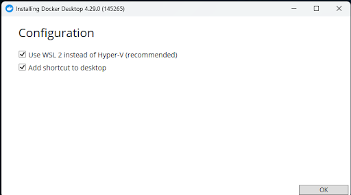
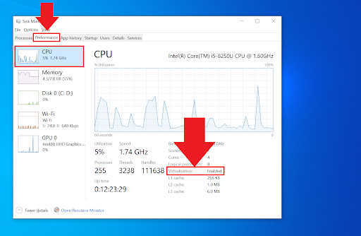

Ссылка для всех ОС: [https://www.docker.com/products/docker-desktop/](https://www.docker.com/products/docker-desktop/)

##### При установке Docker Desktop на Windows не забудьте выбрать WSL 2!




#### Важно помнить:

`Docker Desktop` устанавливает свой собственный `Docker Engine`.

Поэтому, если вы установили Docker ранее, то, скорее всего, у вас будет два РАЗНЫХ `Docker Engine`.

---

### Для Windows необходим `WSL 2`

Проверяем его установку в командной строке:
```
wsl -l -v
```

Нужен результат, где VERSION будет именно 2:
```
  NAME      STATE           VERSION
* Ubuntu    Running         2
```

Если результат иной, вот инструкция по установке WSL 2: [https://learn.microsoft.com/en-us/windows/wsl/install](https://learn.microsoft.com/en-us/windows/wsl/install)


#### Для WSL 2 необходима виртуализация

Вот как в диспетчере задач проверить, включена ли виртуализация 



Если нет, то потребуется включить виртуализацию в BIOS/UEFI и перезагрузить компьютер.

#### Как включить виртуализацию?

Для каждой модели (даже внутри одной торговой марки!) существуют разные инструкции.  

Выход: загуглить (найти) инструкцию для своей конкретной модели.


### Важное дополнение для Linux (Windows и MacOS это не касается)

1. Не обязательно настраивать репозиторий пакетов Docker [(`1. Set up Docker's package repository.`)](https://docs.docker.com/engine/install/ubuntu/#installation-methods)

> Начните установку с пункта 2 (`Download the latest DEB package`)
> * Сначала [скачайте архив](https://desktop.docker.com/linux/main/amd64/docker-desktop-amd64.deb?utm_source=docker&utm_medium=webreferral&utm_campaign=docs-driven-download-linux-amd64)
> * А затем выполните команды
> ```
> sudo apt-get update
> sudo apt install ./docker-desktop-amd64.deb
> ```

2. Добавьте текущего пользователя в группу `docker`


> Чтобы не выполнять каждый раз команду докер "под рутом" (`sudo docker` и так далее),  
> необходимо один раз добавить права текущего пользователя в группу `docker`:
> ```
> sudo usermod -aG docker "$USER"
> ```
> И затем перезагрузить компьютер.  
> После этого команды докера можно будет выполнять без приставки `sudo`.


