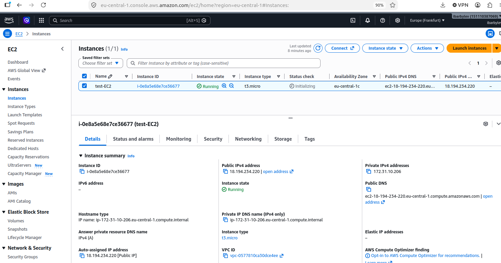

### Как создать AWS EC2-сервер?

1. Зарегистрироваться.
2. Набрать в поиске EC2 и выбрать.
3. Важно: выбрать регион (`Europe(Frankfurt)` или любой другой)
4. Придумать и ввести имя сервера **Name and tags** (`test-EC2`)
5. Выбрать OS (`Ubuntu` по умолчанию)
6. **Amazon Machine Image (AMI)** (оставляем по умолчанию)
7. **Instance type** (`t3.micro` по умолчанию)
8. **Key pair (login)**: первый раз необходимо создать:
   * первый раз необходимо создать: **Create new key pair**:
     * `Key pair name` (`AWS_key`)
     * `ED25519`; `.pem`
     * `Create key pair`
     * Ключ `AWS_key.pem` выгрузится в Downloads
     * Его необходимо перенести в папку`.ssh`
       * Проверяем ключ в папке `.ssh`: `ls -al ~/.ssh`
       * Если права не `-rw------- AWS_key.pem`, то меняем
         * `chmod 600 ~/.ssh/AWS_key.pem`
   * в следующий раз можем выбрать готовый ключ из списка

9. **Network settings**:
   * `Auto-assign public IP` (`Enable` по умолчанию)
   * `Create security group` (или выбрать когда будет) 
     * По умолчанию принимаем:
       * `Allow SSH traffic from`
       * `Anywhere 0.0.0.0/0` (подключаться с любого ip)
         * Можно как было в MongoDB выбрать текущий id (пункт `My IP`). (но не нужно)
       * Когда будет сайт, надо будет добавить к выбору:
         * `Allow HTTP traffic from the internet`
         * `Allow HTTPS traffic from the internet`
10. Конфигурируем жёсткий диск **Configure storage**
    * 8 Gb
    * gp3
11. Можно жать кнопку `Launch instance`.  
    Но прежде **ещё раз** смотрим в каком регионе создаётся сервер.

12. Переходим в пункт меню `EC2` -> `Instances` и смотрим на список наших серверов.

13. Если поставить галочку напротив имени, видно из каких ресурсов состоит 

14. Отсюда нам надо скопировать `Public IPv4 address`: 18.194.234.220 

15. Подключаемся к нашему свеже-созданному серверу по ssh: 
```bash
ssh -i ~/.ssh/AWS_key.pem ec2-user@18.194.234.220
```
где:
`~/.ssh/AWS_key.pem`- путь до ключа `AWS_key.pem`
`ec2-user`          - имя пользователя по умолчанию для Amazon Linux
`18.194.234.220`    - ip сервера из предыдущего пункта

16. Первый раз надо ответить `yes`:

```bash
su@su-HP-ProBook-470-G4:~$ ssh -i ~/.ssh/AWS_key.pem ec2-user@18.194.234.220
The authenticity of host '18.194.234.220 (18.194.234.220)' can't be established.
ED25519 key fingerprint is SHA256:IIhmJmUMB/ny5PGY2HgaBc3szoJ8t4JLQ8BTwIJ969k.
This key is not known by any other names
Are you sure you want to continue connecting (yes/no/[fingerprint])? yes
```

17. В итоге должно получиться примерно так:
```bash
   ,     #_
   ~\_  ####_        Amazon Linux 2023
  ~~  \_#####\
  ~~     \###|
  ~~       \#/ ___   https://aws.amazon.com/linux/amazon-linux-2023
   ~~       V~' '->
    ~~~         /
      ~~._.   _/
         _/ _/
       _/m/'
[ec2-user@ip-172-31-10-206 ~]$ 

```

18. Можно проверить память на диске и RAM:

```bash
[ec2-user@ip-172-31-10-206 ~]$ df -h
Filesystem        Size  Used Avail Use% Mounted on
devtmpfs          4.0M     0  4.0M   0% /dev
tmpfs             457M     0  457M   0% /dev/shm
tmpfs             183M  432K  183M   1% /run
efivarfs          128K  2.7K  121K   3% /sys/firmware/efi/efivars
/dev/nvme0n1p1    8.0G  1.7G  6.4G  21% /
tmpfs             457M     0  457M   0% /tmp
/dev/nvme0n1p128   10M  1.3M  8.7M  13% /boot/efi
tmpfs              92M     0   92M   0% /run/user/1000
[ec2-user@ip-172-31-10-206 ~]$ free -h
               total        used        free      shared  buff/cache   available
Mem:           913Mi       153Mi       512Mi       0.0Ki       246Mi       627Mi
Swap:             0B          0B          0B
[ec2-user@ip-172-31-10-206 ~]$ 
```


### Как удалить сервер?

На странице `EC2 > Instances`:
* Выбираем наш экземпляр
* Нажимаем кнопку `Instance State` -> `Terminate (delete) instance` -> `Terminate (delete)`